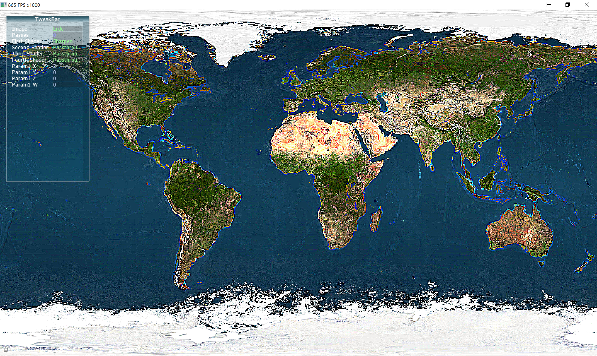

# Aufgabe 1.1
Bei Verwendung des Filters BewMit erscheint das Bild verschwommen. Der BewMit-Filter nimmt eine Einheitsmatrix um alle Pixel im Umfeld des aktuellen Pixels mit der gleichen Gewichtung zusammen zu rechnen, um somit Details aus den Bildbereich verschwimmen zu lassen. Eine Alternative zum erzielen des selben Ergebnis findet sich in Aufgabe 1.2, Teilaufgabe 2.

 

# Aufgab1 1.2

## 1. Brightness_Contrast
Der Brightness_Contrast-Filter soll es möglich machen über den X- und Y-Parameter des Programms die Helligkeit(X) und den Kontrast(Y) des eingegebenen Bildes zu verändern.
Zur erhöhung der Helligkeit müssen alle Werte eines Pixel-Vektors um den gleichen Wert erhöht werden, somit wird lediglich der vom Nutzer angegebene Wert x durch 100 geteilt und anschließend auf den Pixel-Vektor addiert:

`fragColor += param1.x /100.0;`

Zur Erhöhung des Kontrastes muss der Pixel-Vektor mit einem Faktor skaliert werden. Außerdem wird nach der faktorisierung noch eine korrektur addiert, um die Helligkeit des Bildpixels nicht zu verändern:

`fragColor = scale * fragColor + 0.5 * (1.0 - scale) * vec4(1);`

Zu guter letzt wird mithilfe von clamp verhidnert, dass ein Pixel-Vektor nach der anpassung von Helligkeit und Kontrast Werte > 1 enthält.

 

## 2. Gauss3x3
Im gegensatz zum BewMit-Filter wird beim Gauss-Filter ein Algorithmus zur generierung der Gewichtung der umgebenden Pixel verwendet. Diese Funktion ist abhängig von den gegebenen Positionen der Pixel und einer vom Nutzer konfigurierbaren Varianz. Die Funktion zur berechnung der Impulsantwort findet sich [hier](https://de.wikipedia.org/wiki/Gau%C3%9F-Filter#Bildverarbeitung).

```
float varianz(vec2 cords){

	float a = 1/(2.0 * 3.145 * pow(param1.x,2));
	float ba = pow(cords.x,2)+pow(cords.y,2);
	float bb = 2*pow(param1.x,2);

	return  a * exp((ba/bb)*(-1.0));

}
```

 

## 3. Gauss5x5#

Um einen Gauss-Tiefpassfilter mit einer größe von 5x5 Pixeln zu implementieren, wurde schlichtweg der Code des 3x3-Filters kopiert und die Anzahl an Schleifendurchläuzfen zur berechnung des neuen Pixelwertes auf 5x5=25 erhöht.

 

## 4. Gauss7x7
Wie bereits beim 5x5 Gauss-Filter wurde auch hier einfach der Code des 3x3-Filters kopiert und die Anzahl der Schleifendurchläufe in diesem Fall auf 49 erhöht.

 

### Zeiteinsparung durch aufteilung in Vertikal und Horizontal

#### Grundmessung 7x7 mit 2 Passes
ca. 103 FPS

#### Messung mit 2 Passes nach aufteilung in vertikalen und horizontalen Gaussfilter
Im Shader Gauss5x5 wurde die offsets-Matrix in einen horizontalen Vektor mit der Höhe 7 angepasst, in Gauss7x7 wurde ein einzeiliger Vektor mit der breite 7 erstellt. Beide Shader in Kombination erzielen nun das gleiche Ergebnis wie die ursprüngliche Implementierung des Gauss7x7, allerdings wesentlich schneller.

Ergebniss der Messung: ca 440 FPS
Dies entspricht einer Performance-Steigerung von ca. 338%.

Die Einsparung kommt durch die wesentlich geringere ANzahl an Operationen je Pixel. Während beim regulären 7x7 Gaussfilter auch diagonale Werte für jeden Pixel mit in die Berechnung einbezogen werden spart man sich dies bei der Aufteilung in eine vertikale und eine horizontale Berechnung. So spart man sich je Pixel knapp 35 Operationen.

## 5. Laplace
Der Laplace-Filter funktioniert, indem von allen benachbarten Pixeln im 3x3-Bereich vom 8-fachen des aktuellen Pixel-Vektors abgezogen. Der Kern für die Laplace-Filterung sieht also wie folgt aus:

```
const int weight[9] = { -1, -1, -1,
												-1,  8, -1,
												-1, -1, -1};
```

Anschließend wird auch hier wieder `clamp` verwendet um den Pixel-Vektor im gültigen Wertebereich zu halten.

 

## 6. Sobel
Der Soebelbetragsoperator ist eine weitere möglichkeit zur Kantendetektion neben dem Laplace-Filter. Für diesen werden zwei Filterkerne verwendet, mit denen man zwei Bilder als Ergebnis erhält. Das eine Bild zeigt die Kanten in vertikaler Richtung, das andere in horizontaler. Um nun die Ausprägung der Kante an einer bestimmten Position zu erhalten werden die beiden Bilder wie folgt miteinander kombiniert:

```
sqrt(pow(bild1.rgb, 2) + pow(bild2.rgb, 2))
```

 

## 7. Sharpen
Zum schärfen eines Bildes wird das ursprüngliche Bild addiert mit einem Hochpassfilter des Bildes. Um die schärfung über einen Parameter zu steuern, wird dieser Hochpassfilter mit dem Parameter multipliziert. Der Hochpassfilter verwendet den gleichen Filterkern wie der Laplace-Filter.

 

## 8. Dilatation
Bei der Dilatation sollen helle Bereiche verstärkt werden. Dafür wird der aktuelle Pixel auf den maximalen Farbwert aus der Umgebung des aktuellen Pixels gesetzt.

 

## 9. Erosion
Im gegensatz zur Dilatation werden bei der Erosion die dunklen Bereiche verstärkt. Um dies zu erreichen wird hier, anstatt des maximums, das minimum aus der betrachteten Umgebung zu verwenden.

 

# Aufgabe 1.3

## 1. Störungen entfernen
asdf

[insert original here]() [insert filtered here]()

## 2. Kanten extrahieren
asdf

[insert original here]() [insert filtered here]()

## 3. Binärbild erstellen
asdf

[insert original here]() [insert filtered here]()
